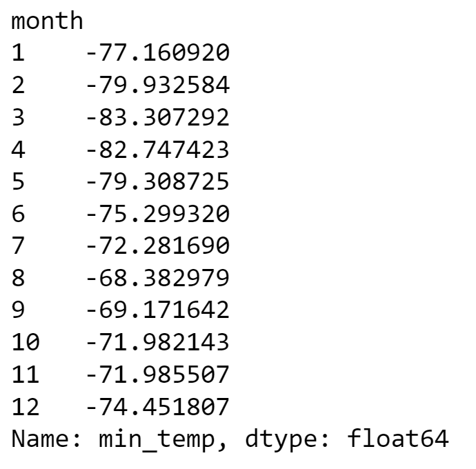

 # web_scraping_with_data_analysis
 Mission to Mars Web Scraping & Data Analysis with Beautiful Soup

# Web Scraping and Data Analysis with Beautiful Soup

Hey, let's explore the data with web scrapping and analyze the data using Beautiful soup and Pandas Python Data Analysis.

### 1 Introduction 

This web scraping and analysis consists of two deliverables.

Deliverable 1: Scrape titles and preview text from Mars news articles.

Deliverable 2: Scrape and analyze Mars weather data, which exists in a table.

### 2 Prerequisites

Before you begin, ensure you have the following installed:

- Python 3.6 or higher
- Beautiful Soup 4
- Requests (for making HTTP requests)
- Pandas (for data analysis)

### 3 Data Sources

We scrape and analyze data from the following sources:

[Mars News Site](https://static.bc-edx.com/data/web/mars_news/index.html)

[Mars Temperature Data Site](https://static.bc-edx.com/data/web/mars_facts/temperature.html)

We have the first webpage of Mars news from where the data is scraped to extract required infromation.

The second website is about temperature data information about mission to mars.

### 4 Deliverable 1 : MARS NEWS

#### 4.1 What to Extract

We use the website to extract the articles information.

We can see how much the article seems interactive on the website.

#### 4.2 How to Visit & Inspect

Use automated browsing to visit the Mars news siteLinks to an external site. Inspect the page to identify which elements to scrape.

Create a Beautiful Soup object and use it to extract text elements from the website.

#### 4.3 Web Scrapping to Python Data Structures

Extract the titles and preview text of the news articles and store the scraping results.

Display the scraped results in the form of python data structures.

#### 4.5 Scraped Data to JSON File

Store the scraped data in a json file to ease sharing the data with others.

### 5 Deliverable 2: Mars Weather Data Analysis

#### 5.1 What to Extract

We use the website to extract the temperature data.

#### 5.2 How to Visit & Inspect

Use automated browsing to visit the Mars Temperature Data SiteLinks to an external site.. Inspect the page to identify which elements to scrape.

Create a Beautiful Soup object and use it to scrape the data in the HTML table.

#### 5.3 Scrape the Table

Get the table rows and text data from table.

Assemble the scraped data into a Pandas DataFrame.

#### 5.4 Data Insights

How many months are there on Mars?

How many Martian days' worth of data are there?

What is the average low temperature by month?

The insights depicts clearly about average low tempertaure on Mars by each month. 

This seems that all the temperature ranges from -65 to -85 degree celsius.

What are the coldest and the warmest months on Mars?

Which months have the lowest and the highest atmospheric pressure on Mars? 

The average daily atmospheric pressure of all the months.

About how many terrestrial (Earth) days exist in a Martian year?

Days elapse on Earth in the time that Mars circles the Sun once.

Visually estimate the result by plotting the daily minimum temperature.

#### 5.5 Scraped Data to CSV File

Store the scraped data in a CSV file to ease sharing the data with others.

### 6 Conclusion

We can use the information about the Mars temperature data insights with respect to days, months and years. 

